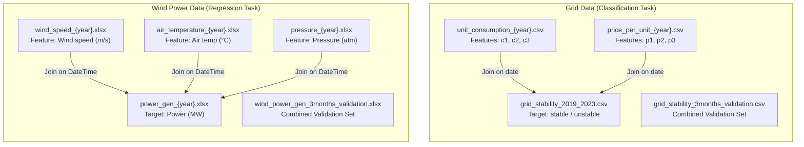

# Comprehensive Dataset Documentation

> [!IMPORTANT]
> This document describes **two datasets** located inside `Hdata/` — one for **electrical grid data** and one for **wind power generation data**. The datasets span **2019–2023** with hourly granularity and include **3-month validation sets** (Jan–Mar 2024) for each domain.

---

## 1. Directory: `Hdata/Grid_data/`

This directory contains **12 CSV files** related to electrical grid operations — specifically **energy consumption**, **pricing**, and **grid stability**.

### 1.1 File Inventory

| File(s) | Count | Format | Years |
|---|---|---|---|
| `unit_consumption_{year}.csv` | 5 | CSV | 2019–2023 |
| `price_per_unit_{year}.csv` | 5 | CSV | 2019–2023 |
| `grid_stability_2019_2023.csv` | 1 | CSV | 2019–2024 Q1 |
| `grid_stability_3months_validation_data.csv` | 1 | CSV | Jan–Mar 2024 |

---

### 1.2 `unit_consumption_{year}.csv` — Energy Consumption Data

**Purpose:** Hourly energy consumption readings for **3 consumers/nodes** on the grid.

| Property | Details |
|---|---|
| **Rows per year** | ~8,759–8,784 (hourly; 8,784 in leap year 2020) |
| **Columns** | `date`, `c1`, `c2`, `c3` |
| **Null values** | **None** across all years |

#### Column Details

| Column | Dtype | Description | Min | Max | Mean | Std |
|---|---|---|---|---|---|---|
| `date` | string | Timestamp in `DD-MM-YYYY HH:MM` format | `01-01-{year} 00:00` or `01:00` | `31-12-{year} 23:00` | — | — |
| `c1` | float64 | Consumer 1 consumption (normalized/scaled) | ≈ −2.0 | ≈ −0.5 | ≈ −1.25 | ≈ 0.43 |
| `c2` | float64 | Consumer 2 consumption (normalized/scaled) | ≈ −2.0 | ≈ −0.5 | ≈ −1.25 | ≈ 0.43 |
| `c3` | float64 | Consumer 3 consumption (normalized/scaled) | ≈ −2.0 | ≈ −0.5 | ≈ −1.25 | ≈ 0.43 |

> [!NOTE]
> The consumption values are **always negative** (range: −2.0 to −0.5), suggesting they represent **power drawn from the grid** using a sign convention where negative = consumption and positive = generation. The values appear to be **normalized/scaled** (not raw kWh or MW). All three consumers show very similar statistical distributions.

#### Sample Rows (2019)
```
               date        c1        c2        c3
0  01-01-2019 01:00 -0.782604 -1.257395 -1.723086
1  01-01-2019 02:00 -1.940058 -1.872742 -1.255012
2  01-01-2019 03:00 -1.207456 -1.277210 -0.920492
```

---

### 1.3 `price_per_unit_{year}.csv` — Energy Pricing Data

**Purpose:** Hourly energy price for **3 pricing tiers/nodes**.

| Property | Details |
|---|---|
| **Rows per year** | ~8,759–8,784 (hourly) |
| **Columns** | `date`, `p1`, `p2`, `p3` |
| **Null values** | **None** across all years |

#### Column Details

| Column | Dtype | Description | Min | Max | Mean | Std |
|---|---|---|---|---|---|---|
| `date` | string | Timestamp in `DD-MM-YYYY HH:MM` format | `01-01-{year}` | `31-12-{year}` | — | — |
| `p1` | float64 | Price tier/node 1 (normalized) | ≈ 0.05 | ≈ 1.0 | ≈ 0.52 | ≈ 0.27 |
| `p2` | float64 | Price tier/node 2 (normalized) | ≈ 0.05 | ≈ 1.0 | ≈ 0.53 | ≈ 0.27 |
| `p3` | float64 | Price tier/node 3 (normalized) | ≈ 0.05 | ≈ 1.0 | ≈ 0.52 | ≈ 0.27 |

> [!NOTE]
> Price values are **normalized between ~0.05 and ~1.0**. The distribution is approximately **uniform** (mean ≈ 0.52, std ≈ 0.27), consistent with a uniform distribution over [0.05, 1.0]. All three price series have virtually identical statistics.

#### Sample Rows (2019)
```
               date        p1        p2        p3
0  01-01-2019 01:00  0.859578  0.887445  0.958034
1  01-01-2019 02:00  0.862414  0.562139  0.781760
2  01-01-2019 03:00  0.766689  0.839444  0.109853
```

---

### 1.4 `grid_stability_2019_2023.csv` — Grid Stability Labels (Training)

**Purpose:** Hourly **binary classification label** indicating whether the electrical grid is stable or unstable.

| Property | Details |
|---|---|
| **Shape** | 46,007 rows × 2 columns |
| **Columns** | `date`, `stability` |
| **Date range** | `01-01-2019 01:00` → `31-03-2024 23:00` |
| **Null values** | **None** |

#### Label Distribution

| Label | Count | Percentage |
|---|---|---|
| `unstable` | 29,357 | **63.8%** |
| `stable` | 16,650 | **36.2%** |

> [!WARNING]
> The dataset is **imbalanced** — `unstable` is nearly 2× more frequent than `stable`. Any classification model should account for this imbalance (e.g., via class weights, oversampling, or appropriate metrics like F1/AUC rather than raw accuracy).

#### Sample Rows
```
               date stability
0  01-01-2019 01:00  unstable
1  01-01-2019 02:00    stable
2  01-01-2019 03:00  unstable
```

---

### 1.5 `grid_stability_3months_validation_data.csv` — Validation Set

**Purpose:** A **pre-built validation/test set** covering **Jan 1 – Mar 31, 2024** with all features and labels combined in one file.

| Property | Details |
|---|---|
| **Shape** | 2,184 rows × 8 columns |
| **Columns** | `date`, `c1`, `c2`, `c3`, `p1`, `p2`, `p3`, `stability` |
| **Date range** | `01-01-2024 00:00` → `31-03-2024 23:00` |
| **Null values** | **None** |

#### Validation Label Distribution

| Label | Count | Percentage |
|---|---|---|
| `unstable` | 1,421 | **65.1%** |
| `stable` | 763 | **34.9%** |

> [!TIP]
> This file is the **validation/test set** for a grid stability classification task. It contains **all features merged** (consumption c1–c3 + prices p1–p3) with the `stability` target. The training data (2019–2023) is split between the separate `unit_consumption_*.csv`, `price_per_unit_*.csv`, and `grid_stability_2019_2023.csv` files and must be **joined on the `date` column** before training.

#### Sample Rows
```
               date        c1        c2        c3        p1        p2        p3 stability
0  01-01-2024 00:00 -1.940140 -0.798906 -1.171796  0.209084  0.125430  0.056619    stable
1  01-01-2024 01:00 -1.431471 -0.523455 -1.481922  0.659985  0.565942  0.252764    stable
2  01-01-2024 02:00 -0.791358 -1.134176 -1.023553  0.083137  0.411446  0.376176    stable
```

---

## 2. Directory: `Hdata/wind_power_data/`

This directory contains **21 Excel (.xlsx) files** related to **wind turbine power generation** and the meteorological factors that influence it.

### 2.1 File Inventory

| File(s) | Count | Format | Years |
|---|---|---|---|
| `wind_speed_{year}.xlsx` | 5 | Excel | 2019–2023 |
| `air_temperature_{year}.xlsx` | 5 | Excel | 2019–2023 |
| `pressure_{year}.xlsx` | 5 | Excel | 2019–2023 |
| `power_gen_{year}.xlsx` | 5 | Excel | 2019–2023 |
| `wind_power_gen_3months_validation_data.xlsx` | 1 | Excel | Jan–Mar 2024 |

---

### 2.2 `wind_speed_{year}.xlsx` — Wind Speed

**Purpose:** Hourly wind speed measurements (likely from an anemometer at hub height of a wind turbine).

| Property | Details |
|---|---|
| **Rows per year** | ~8,759–8,784 (hourly) |
| **Columns** | `DateTime`, `Wind speed | (m/s)` |
| **Null values** | **None** |

| Column | Dtype | Min | Max | Mean | Std |
|---|---|---|---|---|---|
| `DateTime` | datetime64 | `{year}-01-01 00:00` | `{year}-12-31 23:00` | — | — |
| `Wind speed \| (m/s)` | float64 | 0.14 | 16.88 | ≈ 5.9 | ≈ 2.95 |

#### Sample Rows (2019)
```
                 DateTime  Wind speed | (m/s)
0 2019-01-01 01:00:00.000               9.014
1 2019-01-01 02:00:00.000               9.428
2 2019-01-01 03:00:00.005               8.700
```

---

### 2.3 `air_temperature_{year}.xlsx` — Air Temperature

**Purpose:** Hourly air temperature measurements at the turbine site.

| Property | Details |
|---|---|
| **Rows per year** | ~8,759–8,784 (hourly) |
| **Columns** | `DateTime`, `Air temperature | (°C)` |
| **Null values** | **None** |

| Column | Dtype | Min | Max | Mean | Std |
|---|---|---|---|---|---|
| `DateTime` | datetime64 | `{year}-01-01` | `{year}-12-31` | — | — |
| `Air temperature \| (°C)` | float64 | −9.06 | 38.81 | ≈ 16.2 | ≈ 9.5 |

> [!NOTE]
> The temperature range (−9°C to +39°C) suggests a **temperate climate** with hot summers and cold winters, consistent with locations in southern Europe, parts of the Mediterranean, or similar mid-latitude regions.

#### Sample Rows (2019)
```
                 DateTime  Air temperature | (°C)
0 2019-01-01 01:00:00.000                  10.926
1 2019-01-01 02:00:00.000                   9.919
2 2019-01-01 03:00:00.005                   8.567
```

---

### 2.4 `pressure_{year}.xlsx` — Atmospheric Pressure

**Purpose:** Hourly atmospheric pressure measurements at the turbine site.

| Property | Details |
|---|---|
| **Rows per year** | ~8,759–8,784 (hourly) |
| **Columns** | `DateTime`, `Pressure | (atm)` |
| **Null values** | **None** |

| Column | Dtype | Min | Max | Mean | Std |
|---|---|---|---|---|---|
| `DateTime` | datetime64 | `{year}-01-01` | `{year}-12-31` | — | — |
| `Pressure \| (atm)` | float64 | 0.961 | 0.998 | ≈ 0.982 | ≈ 0.005 |

> [!NOTE]
> Pressure is measured in **atmospheres (atm)**, not hPa/mbar. The values are consistently **below 1.0 atm** (mean ≈ 0.982), indicating the site is at a **moderate elevation** above sea level. Pressure affects air density, which in turn affects wind turbine power output.

#### Sample Rows (2019)
```
                 DateTime  Pressure | (atm)
0 2019-01-01 01:00:00.000          0.979103
1 2019-01-01 02:00:00.000          0.979566
2 2019-01-01 03:00:00.005          0.979937
```

---

### 2.5 `power_gen_{year}.xlsx` — Wind Power Generation (Target)

**Purpose:** Hourly **actual power generated** by the wind turbine system. This is the **target/label** for regression.

| Property | Details |
|---|---|
| **Rows per year** | ~8,759–8,784 (hourly) |
| **Columns** | `DateTime`, `Power generated by system | (MW)` |
| **Null values** | **None** |

| Column | Dtype | Min | Max | Mean | Std |
|---|---|---|---|---|---|
| `DateTime` | datetime64 | `{year}-01-01` | `{year}-12-31` | — | — |
| `Power generated by system \| (MW)` | float64 | 0.0 | 60.44 | ≈ 14.4 | ≈ 16.9 |

> [!IMPORTANT]
> - **Max output ≈ 60 MW** suggests the rated capacity of the wind farm.
> - **25th percentile = 0.0 MW** — the turbine produces **zero power at least 25% of the time** (low/no wind).
> - **Mean ≈ 14.4 MW** with **Std ≈ 16.9 MW** — very high variability, characteristic of wind energy.
> - The **capacity factor** is approximately **14.4 / 60 ≈ 24%**, which is typical for onshore wind farms.

#### Sample Rows (2019)
```
                 DateTime  Power generated by system | (MW)
0 2019-01-01 01:00:00.000                           33.6881
1 2019-01-01 02:00:00.000                           37.2619
2 2019-01-01 03:00:00.005                           30.5029
```

---

### 2.6 `wind_power_gen_3months_validation_data.xlsx` — Validation Set

**Purpose:** A **pre-built validation/test set** for Jan 1 – Mar 31, 2024 with all 4 features merged.

| Property | Details |
|---|---|
| **Shape** | 2,184 rows × 5 columns |
| **Columns** | `DateTime`, `Air temperature | (°C)`, `Pressure | (atm)`, `Wind speed | (m/s)`, `Power generated by system | (MW)` |
| **Date range** | `2024-01-01 00:00` → `2024-03-31 23:00` |
| **Null values** | **None** |

#### Validation Statistics

| Feature | Mean | Std | Min | Max |
|---|---|---|---|---|
| Air temperature (°C) | 10.36 | 7.60 | −7.31 | 28.61 |
| Pressure (atm) | 0.983 | 0.006 | 0.963 | 0.996 |
| Wind speed (m/s) | 6.96 | 3.02 | 0.30 | 15.92 |
| Power generated (MW) | 20.57 | 19.37 | 0.0 | 60.44 |

> [!TIP]
> This file is the **validation/test set** for a wind power prediction regression task. It has all features merged. The training data (2019–2023) is split across separate files and must be **joined on the `DateTime` column** before training.

#### Sample Rows
```
             DateTime  Air temperature | (°C)  Pressure | (atm)  Wind speed | (m/s)  Power generated by system | (MW)
0 2024-01-01 00:00:00                   6.609          0.988077              10.868                           53.1810
1 2024-01-01 01:00:00                   5.257          0.988969              10.679                           51.9083
2 2024-01-01 02:00:00                   4.374          0.989708              11.200                           56.3540
```

---

## 3. Summary: How the Two Datasets Relate



---

## 4. Key Technical Notes for Model Building

### Grid Stability (Classification)
| Aspect | Detail |
|---|---|
| **Task type** | Binary classification (`stable` vs `unstable`) |
| **Features** | `c1`, `c2`, `c3` (consumption), `p1`, `p2`, `p3` (pricing) — 6 numeric features |
| **Target** | `stability` (categorical: `stable` / `unstable`) |
| **Training data** | 2019–2023 (~43,800 hourly rows), must JOIN 3 separate CSVs on `date` |
| **Validation data** | Jan–Mar 2024 (2,184 rows), already merged in one file |
| **Date format** | String: `DD-MM-YYYY HH:MM` |
| **Class imbalance** | ~64% unstable / ~36% stable |
| **No missing values** | ✅ All files are complete |

### Wind Power Generation (Regression)
| Aspect | Detail |
|---|---|
| **Task type** | Regression (predict MW output) |
| **Features** | Wind speed (m/s), Air temperature (°C), Pressure (atm) — 3 numeric features |
| **Target** | `Power generated by system | (MW)` |
| **Training data** | 2019–2023 (~43,800 hourly rows), must JOIN 4 separate XLSX files on `DateTime` |
| **Validation data** | Jan–Mar 2024 (2,184 rows), already merged in one file |
| **Date format** | `datetime64` (proper datetime) |
| **Key characteristic** | Heavy zero-inflation (≥25% of hours produce 0 MW) |
| **No missing values** | ✅ All files are complete |

### Important Data Quirks
1. **Date format mismatch**: Grid data uses **string dates** (`DD-MM-YYYY HH:MM`), while wind data uses **proper datetime64** objects. Parsing is needed for the grid data.
2. **2019 starts at 01:00**: In 2019, both grid and wind datasets start at hour `01:00` instead of `00:00` (8,759 rows instead of 8,760). Other years start at `00:00`.
3. **2020 has 8,784 rows**: Leap year is correctly accounted for.
4. **Microsecond offsets in 2019 timestamps**: The wind data for 2019 has tiny microsecond offsets in `DateTime` (e.g., `01:00:00.000`, `03:00:00.005`, `04:00:00.010`). These should be **rounded/truncated** to the nearest hour before joining.
5. **Column names contain pipe characters**: Wind data columns like `Wind speed | (m/s)` contain `|` characters with spaces. Use exact column names or rename them early in preprocessing.
